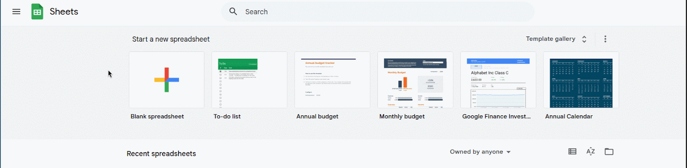
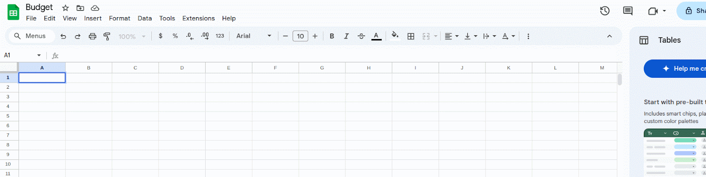
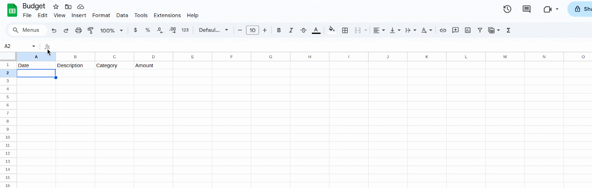
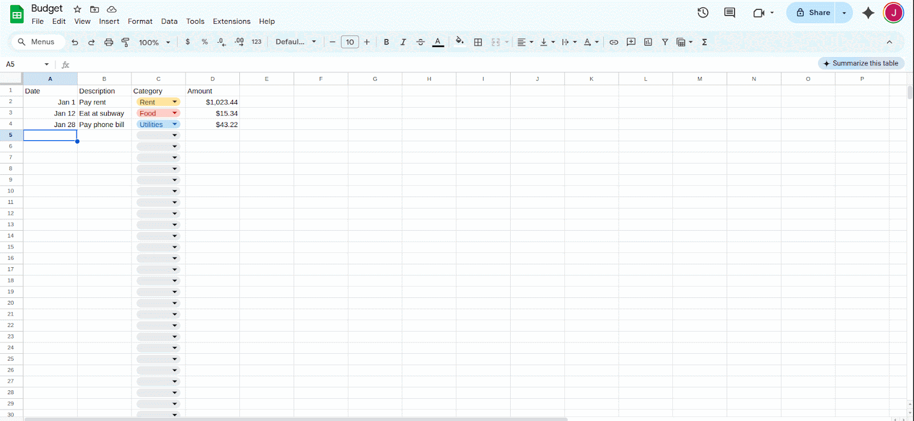
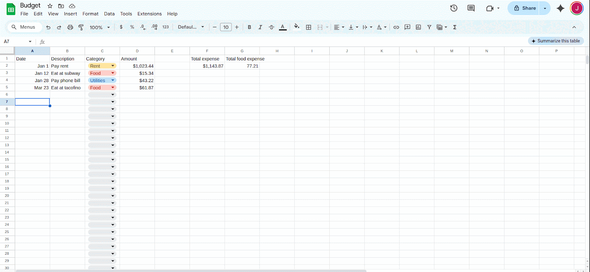
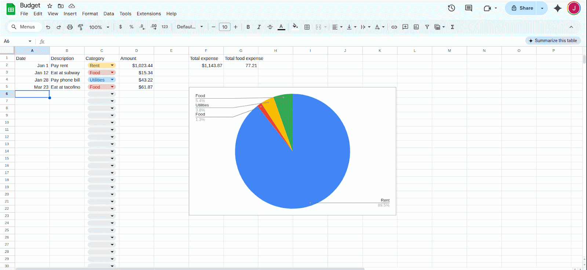

# Task 1: Build a Personal Budget Tracker with Automatic Totals

This task walks you through building a personal budget tracker using Google Sheets. By the end of this task, you'll have a working sheet that records your expenses, categorizes them, calculates totals, and shows a pie chart of where your money goes.

---

## 1 – Create a new Google Sheet
Open Google Sheets and create a new blank spreadsheet. Give it a meaningful title like `My Budget Tracker`.



---

## 2 – Set up your columns
In Row 1, enter the following headers:

```
Date | Description | Category | Amount
```

These will be the core of your budget log.



---

## 3 – Format the "Amount" column as currency
Select the "Amount" column (column D), then go to `Format > Number > Currency` to ensure all amounts display as dollars.



---

## 4 – Add a dropdown list for your "Category" column
Use data validation to keep categories consistent. First select column C. Then go to `Data > Data validation`. Finally, choose `List of items` and enter something like:
```
Food, Rent, Utilities, Entertainment, Transportation, Other
```
After entering your categories, click `Done`.

!!! tip
    You can add or edit these categories later, but be consistent with spelling to avoid filtering issues.


---

## 5 – Add a total sum
Below the "Amount" column, enter:
```excel
=SUM(D2:D)
```
This will add up all your recorded expenses.



---

## 6 – Add a total for a specific category (such as "Food")
In an empty cell, use:
```excel
=SUMIF(C2:C, "Food", D2:D)
```
This will total only the amounts labeled "Food".

!!! warning
    Category names in the formula must exactly match what's in your dropdown list.


---

## 7 – Insert a pie chart
Go to `Insert > Chart`, then in the `Chart editor` on the right hand side, choose `C2:C` as the label and `D2:D` as the data range.




---

## 8 – Lock the header row
Go to `View > Freeze > 1 row`.

This keeps your headers visible as you scroll.



---

## What you’ve built
You now have a working personal budget tracker which 

+ is easy to fill out and update
+ sums your expenses
+ contains a pie chart for visualizing sources of expense

This tracker can be expanded later with things like monthly filters, savings goals, or automatic formatting.

---

!!! tip
    Want to reuse this sheet? Make a copy and clear out the rows — the formulas and dropdowns will still work.

