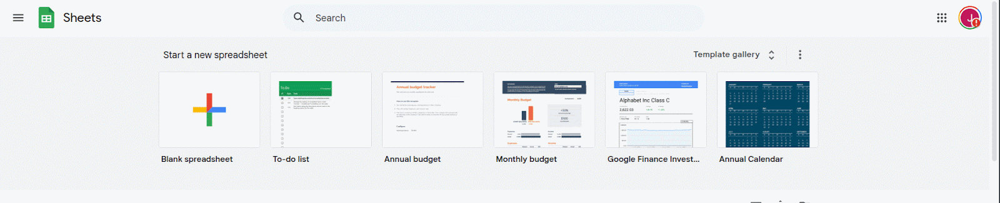
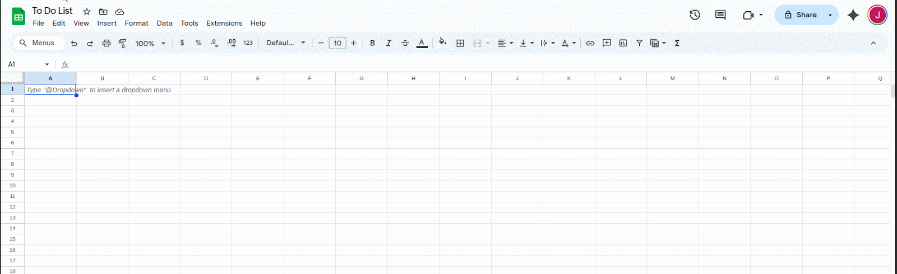
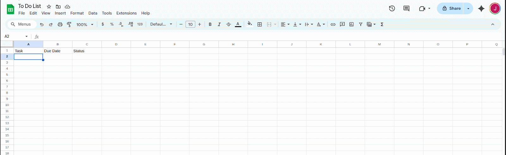
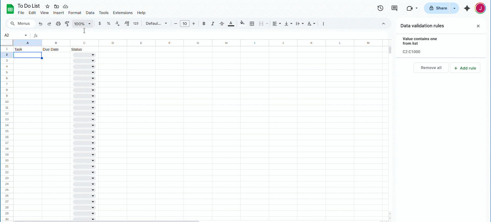
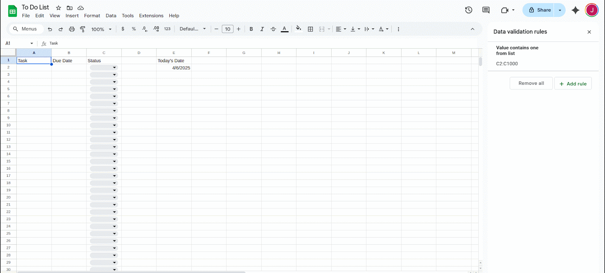
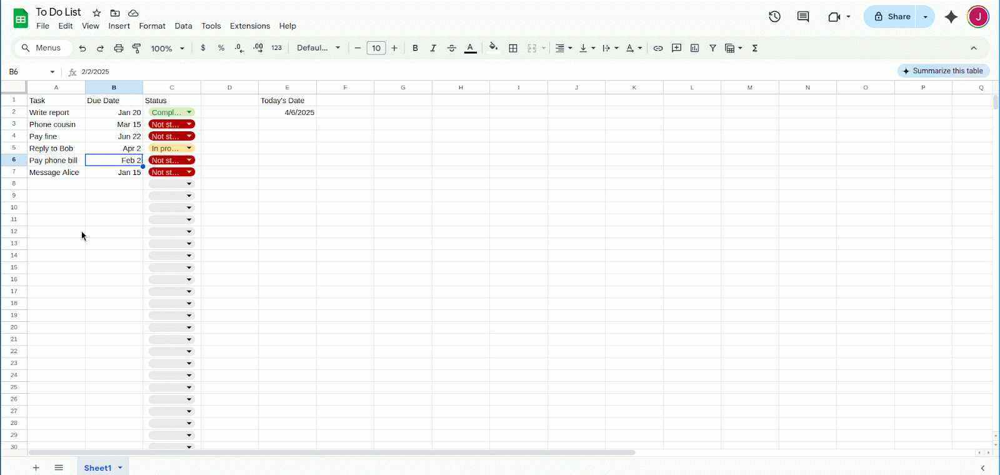
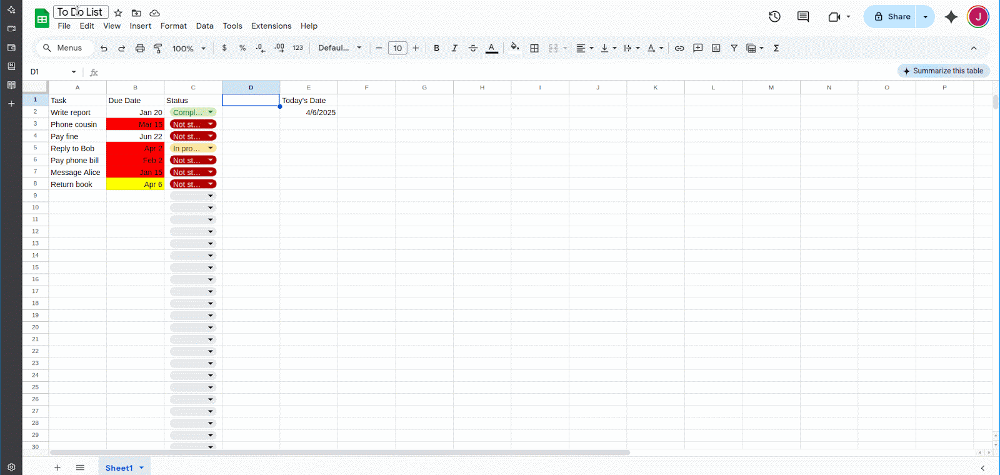
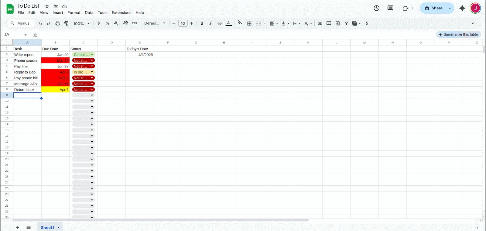

# Task 2: Create a To-Do Tracker with Conditional Highlights

In this task, you'll create a simple to-do tracker that uses conditional formatting to visually flag urgent or overdue tasks. You'll also learn how to lock important parts of the sheet and add filters for easier use.

---

## 1 – Create a new Google Sheet
Open Google Sheets and start a new blank spreadsheet. Give it a name like `To-Do Tracker`.



---

## 2 – Add columns
In Row 1, add the following column headers:

```
Task | Due Date | Status
```



---

## 3 – Format the "Due Date" column
Select the "Due Date" column (Column B), then go to `Format > Number > Date`.



---

## 4 – Add a dropdown list for the "Status" column
Select column C. Go to `Data > Data validation`, choose `List of items`, and enter:
```
Completed, In progress, Not started
```
Then click `Done`.


---

## 5 – Add a "Today's Date" cell
Pick an empty cell near the top (e.g., E1), and enter:
```excel
=TODAY()
```
This cell will always hold the current date.



---

## 6 – Add some example tasks
Fill in a few rows with sample tasks to get a better sense of what the sheet will look like in use. 



---

## 7 – Highlight overdue tasks
Select all of Column B and go to `Format > Conditional formatting`. Use the following custom formula:
```excel
=AND(ISDATE(B2), B2 < TODAY(), C2 <> "Completed")
```
Choose a red background or other clear indicator for overdue items.

!!! warning
    If your headers are in row 1, make sure your formatting starts at row 2 or the formula may highlight the header.


---

## 8 – Highlight upcoming tasks (due in 3 days or fewer)
Add a second rule to the same range with this formula:
```excel
=AND(ISDATE(B2), B2 - TODAY() <= 3, B2 - TODAY() >= 0, C2 <> "Completed")
```
This highlights uncompleted items that will be due within the next 3 days.



---

## 9 – Add a filter for incomplete tasks
Click the filter icon in the toolbar (or go to `Data > Create a filter`). Then click the filter dropdown in the "Status" column and deselect "Completed".



---

## 10 – Protect the header row
Select Row 1, right-click, and choose `Protect range`. Set the permissions to only allow yourself (or selected editors) to change the headers.

!!! Note
    Protecting headers ensures no one accidentally deletes your categories or breaks your formulas.



---

## What you’ve built
You've now created a lightweight but powerful task tracker that:

+ visually flags overdue and upcoming tasks
+ allows filtering by task status
+ protects your structure from accidental edits

You can continue to build on this with more columns (e.g. "Priority" or "Assigned to"), or share it with a team.

