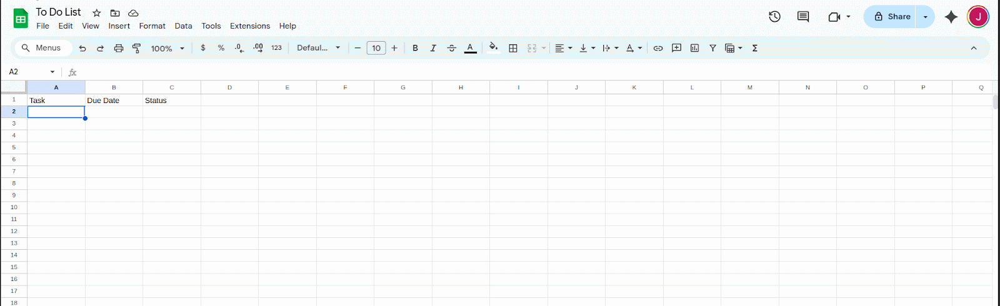
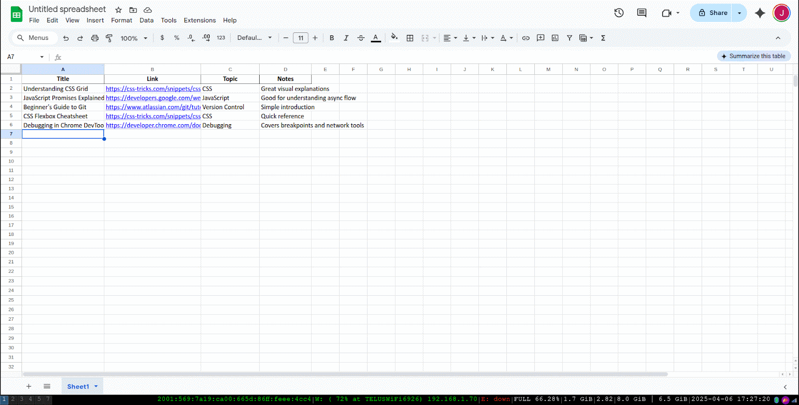
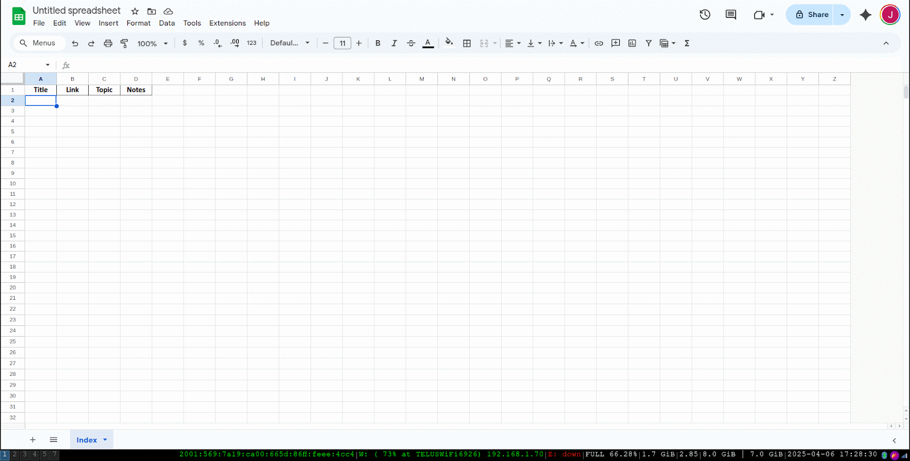
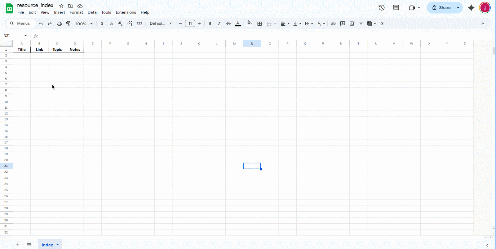
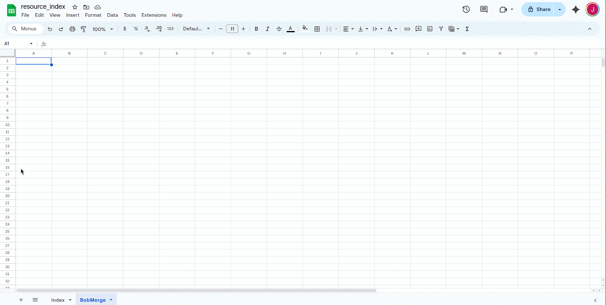
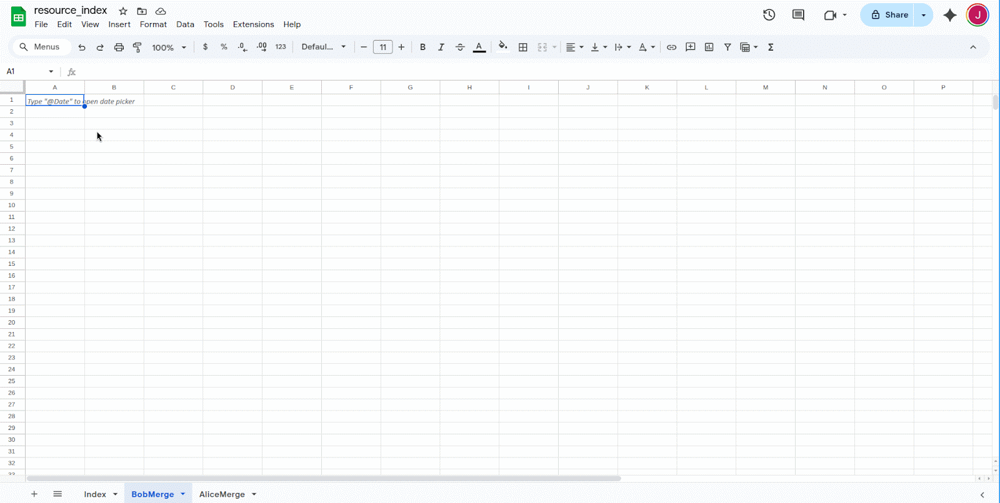
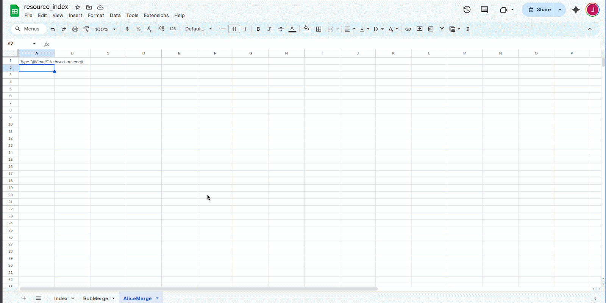
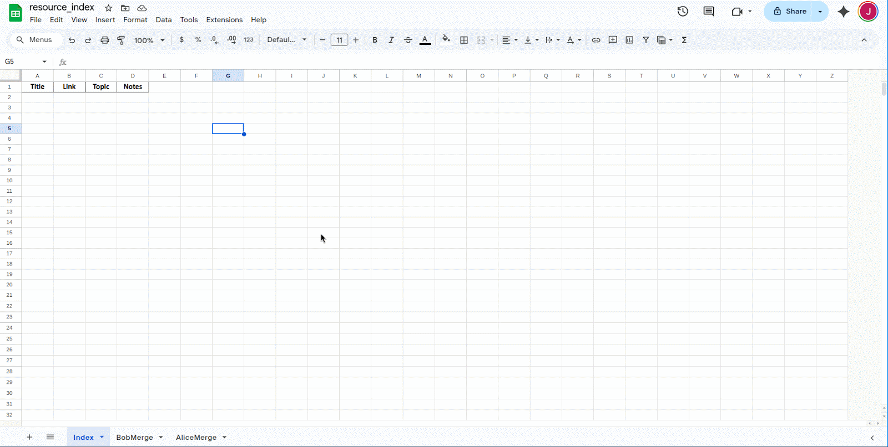
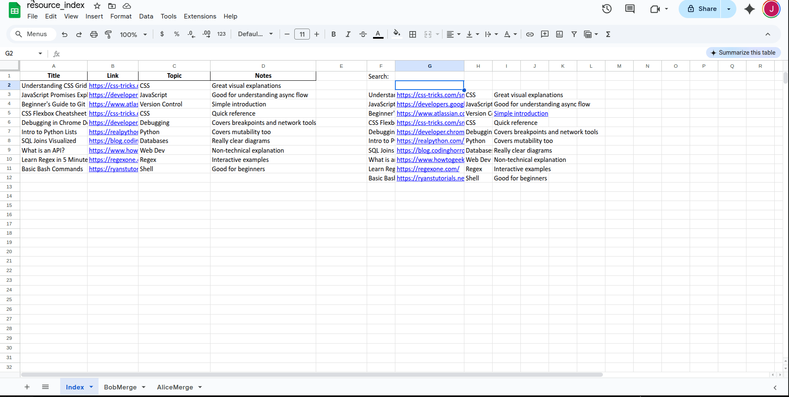

# Task 3: Merge Contributor Sheets into a Searchable Resource Index

This task guides you through setting up a system in Google Sheets that imports resources from multiple contributors and combines them into a single, searchable index. You'll use `IMPORTRANGE`, `QUERY`, and `FILTER` to make the data live and filterable.

---

## 1 – Create or open the source sheets
Make sure each contributor has their own Google Sheet with consistent columns:
```
Title | Link | Topic | Notes
```
Consistency matters. All sheets should use the same column names and order.

!!! warning
    If columns don't match between source sheets, the merge step will break or produce incorrect results.




---

## 2 – Create a target sheet
This is where the merged index will live. Create a new Google Sheet and name it something like `Resource Index`.



---

## 3 – Create a sheet for the first import
Inside your target sheet, add a new sheet tab (e.g. `AliceImport`). In cell A2, add:
```excel
=IMPORTRANGE("URL_A", "Sheet1!A2:D")
```
Replace `URL_A` with the full URL of the contributor's sheet (without `/edit?...`). Click “Allow access” when prompted.



---

## 4 – Create a sheet for the second import
Repeat Step 3 in a new tab (e.g. `BobImport`). Update the formula to:
```excel
=IMPORTRANGE("URL_B", "Sheet1!A2:D")
```
Again, click “Allow access” if asked.



---

## 5 – Import data into each tab
At this point, both import tabs (`AliceImport`, `BobImport`) should display live data from their respective sheets. If not, check the URLs and click "Allow access".



---

## 6 – Merge the imported data
Go back to your main sheet and enter the following formula in cell A2:
```excel
=QUERY({AliceImport!A2:D; BobImport!A2:D}, "SELECT * WHERE Col1 IS NOT NULL", 0)
```
This stacks the two imports and removes any blank rows.

!!! tip
    Add more sources by continuing the stack: `{A; B; C; D; ...}`



---

## 7 – Add a search bar
Choose a nearby cell (e.g. F1) and type `Search:`. In G1, the user can enter a keyword.
Below that, use:
```excel
=FILTER(A2:D, ISNUMBER(SEARCH(G1, A2:A)) + ISNUMBER(SEARCH(G1, C2:C)))
```
This filters the merged list by title or topic.



---

## 8 – Protect the merged table
Select the merged data area (e.g. A2:D). Right-click, choose `Protect range`, and limit editing permissions. This prevents accidental overwrites.

!!! tip
    You can still allow edits on the search bar while locking down the core table.



---

## What you've built
You've now created a live, multi-source resource index that:

+ automatically updates when contributors update their sheets
+ filters by keyword using a simple search bar
+ protects important data from being accidentally changed

You can expand this setup to support more contributors, add topic filters, or include a “contributor” column for sorting and attribution.

